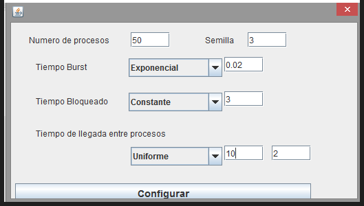

# EJERCICIO 1

## Enunciado

Dado la siguiente configuración de entrada de procesos:

Simular paso a paso con cada una de las políticas de planificación intentando determinar con una unidad de tiempo de antelación cual será la siguiente tarea que se ejecute.

- ¿Qué algoritmo de planificación ofrece un mejor tiempo de respuesta medio?
- Calcula los tiempos de retorno de medio para cada algoritmo.
- ¿Qué clase de problema se ve agudizado con las políticas "Expropiable" y "No expropiable"?
- Con lo observado en la simulación, ¿Preemptive Shortest job First es "Expropiable" o "No Expropiable"?

---
