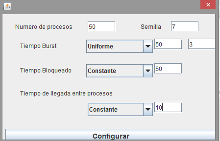

# EJERCICIO 2

## Enunciado

Planteado el siguiente escenario.

## Valores

Numero de procesos: 50
Semilla: 7
Tiempo Burst: Uniforme 50 3
Tiempo Bloqueado: Constante 50
Tiempo de llegada entre procesos
Constante 10

Simular paso a paso con cada una de las políticas de planificación intentando determinar con una unidad de tiempo de antelación cual será la siguiente tarea que se ejecute.

- Entre los Algoritmos de FIFO y Menos tiempo restante primero:
- ¿Quién funciona mejor para las siguientes situaciones?
  - a. Tiene inconvenientes, porque puede causar riesgo de inanición de los procesos de larga duración.
  - b. Tiende a favorecer aquellos procesos que requieren más tiempo de CPU.
  - c. Tiende a tener ventajas cuando minimiza el tiempo de espera medio.

- Entre Los Algoritmos Expropiable y No Expropiable: defina cuál de las siguientes afirmaciones son correctas:
  - a. Permite cambiar de proceso en plena ejecución.
  - b. Los procesos de larga duración sufren riesgo de inanición.
  - c. Adecuado para implementar tiempo compartido.
  - d. Si el quantum es muy pequeño se provocarían constantemente cambios de contexto, disminuyendo el rendimiento.
  - e. Tiene tiempos de espera bastantes largos.

  ---
