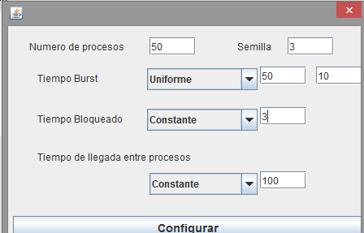

# EJERCICIO 3

## Enunciado

Planteado el siguiente escenario.

Simular paso a paso con cada una de las políticas de planificación intentando determinar con una unidad de tiempo de antelación cual será la siguiente tarea que se ejecute.

¿Cuál es el Tiempo de Respuesta en todos los casos?

¿Qué puede observar de los resultados obtenidos?, ¿Por qué sucede esta situación?
