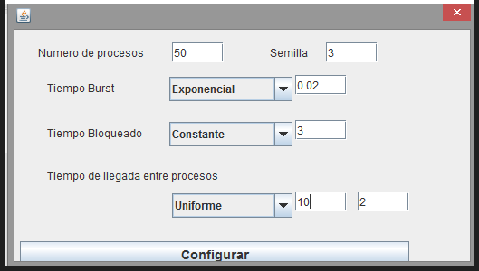
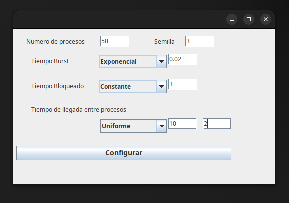
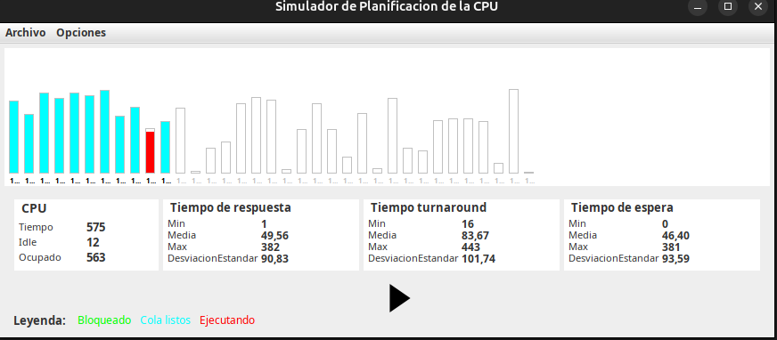
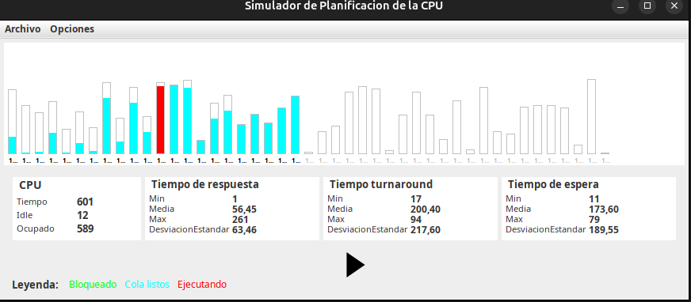

# EJERCICIO 1

Dado la siguiente configuración de entrada de procesos:

Simular paso a paso con cada una de las políticas de planificación intentando determinar con una unidad de tiempo de antelación cual será la siguiente tarea que se ejecute.

- ¿Qué algoritmo de planificación ofrece un mejor tiempo de respuesta medio?
- Calcula los tiempos de retorno de medio para cada algoritmo.
- ¿Qué clase de problema se ve agudizado con las políticas "Expropiable" y "No expropiable"?
- Con lo observado en la simulación, ¿Preemptive Shortest job First es "Expropiable" o "No Expropiable"?

---

## Resolución – Ejercicio 1

### Configuracion

Ir a: Archivo → Configuración de los procesos

| Campo                              | Valor según el enunciado |
|-----------------------------------|---------------------------|
| **Número de procesos**            | `50`                      |
| **Semilla**                       | `3`                       |
| **Tiempo Burst**                  | `[ Exponencial ]`         |
| **Valor (media λ)**               | `0.02`                    |
| **Tiempo Bloqueado**              | `[ Constante ]` → `3`     |
| **Tiempo de llegada entre procesos** | `[ Uniforme ]`         |
| **Valor medio**                   | `10`                      |
| **Desviación estándar**           | `2`                       |

Luego presionar el botón **Configurar** para guardar los parámetros.

---

### Generar los procesos

Ir a: Archivo → Nuevos procesos (aleatorios)

Esto genera los 50 procesos con los parámetros cargados anteriormente.

---

### Simular cada algoritmo

Ir a: Opciones → Algoritmos

Simular los siguientes algoritmos uno por uno:

1. Ejecutás con **FIFO (No expropiable)**
2. Ir a: Archivo → Resetear

3. Ejecutás con **Menos tiempo restante primero (No expropiable)**
4. Ir a: Archivo → Resetear

5. Ejecutás con **Round Robin (Expropiable)** → Quantum `5`
6. Ir a: Archivo → Resetear

7. Ejecutás con **PSJF**
8. Ir a: Archivo → Resetear

---

## Resultados y comparación entre algoritmos

A continuación se detallan los tiempos promedio obtenidos al aplicar cada política de planificación sobre un mismo conjunto de 50 procesos generados con parámetros comunes.

| Algoritmo                        | Tiempo de respuesta medio | Tiempo de regreso medio (turnaround) | Tiempo de espera medio |
|----------------------------------|----------------------------|--------------------------------------|-------------------------|
| FIFO                             | 166,56 ms                 | 210,50 ms                            | 153,38 ms              |
| Menos tiempo restante primero    | 49,56 ms                  | 83,67 ms                             | 46,40 ms               |
| Round Robin (Quantum = 5)        | 56,45 ms                  | 200,40 ms                            | 173,60 ms              |
| PSJF (Preemptive Shortest Job)   | 36,93 ms                  | 83,57 ms                             | 46,50 ms               |

---

## Análisis de los resultados

### ¿Qué algoritmo ofrece mejor tiempo de respuesta?

- **PSJF (Preemptive Shortest Job First)** tiene el **mejor tiempo de respuesta promedio**: `36,93 ms`.

### ¿Cuál minimiza el tiempo de regreso?

- **PSJF** y **Menos tiempo restante primero (SJF)** tienen tiempos de turnaround similares (~`83,6 ms`), siendo ambos los mejores en esta métrica.

### ¿Qué clase de problema se ve agudizado con las políticas?

- **Políticas no expropiables** (como FIFO, SJF):
  - Sufren de **espera prolongada** para procesos que llegan después si los primeros son largos.
  - **Inanición** (starvation) en SJF: los procesos largos pueden nunca ejecutarse si llegan muchos cortos.

- **Políticas expropiables** (como RR y PSJF):
  - Más justas en distribución de CPU.
  - En Round Robin, si el quantum es muy chico, hay **muchos cambios de contexto**, lo que puede **afectar el rendimiento** (como se ve con el turnaround más alto: `200,4 ms`).

### ¿PSJF es expropiativo o no?

- **Sí**, PSJF es **expropiativo**: interrumpe al proceso actual si llega uno más corto.

---

### Observación paso a paso de las políticas

Durante la ejecución paso a paso de cada política, se analizaron las decisiones del planificador con una unidad de tiempo de anticipación. Se identificó lo siguiente:

- **FIFO (No expropiable):** el planificador siempre selecciona el proceso que llegó primero. Es fácil anticipar la próxima tarea: es el siguiente en la cola de llegada.

- **Menos tiempo restante primero (SJF no expropiable):** selecciona el proceso con menor tiempo estimado de CPU. Aunque no interrumpe procesos en ejecución, la elección del próximo proceso se puede prever al conocer la duración de todos los procesos listos.

- **Round Robin (expropiable):** asigna un quantum fijo a cada proceso. Los procesos se alternan en orden. Se puede predecir la próxima tarea observando la posición en la cola y el orden rotativo.

- **PSJF (expropiable):** en cada instante compara el tiempo restante de los procesos listos. Si aparece uno con menor tiempo, interrumpe el actual. Anticipar la próxima tarea requiere observar dinámicamente todos los tiempos restantes en la cola.

Este análisis evidencia cómo varía la “predictibilidad” del comportamiento del planificador según el algoritmo utilizado.

---

## Conclusión

El simulador demuestra que **PSJF** es el algoritmo que ofrece el **mejor balance entre tiempos de respuesta y turnaround**, al priorizar constantemente al proceso más corto.  
**SJF** también presenta buenos resultados, aunque no interrumpe procesos en ejecución.  
**FIFO**, a pesar de su simplicidad, tiene los peores tiempos debido a la posibilidad de que procesos largos bloqueen a todos los demás.  
**Round Robin**, aunque más equitativo, presenta mayores tiempos de turnaround cuando los procesos son muy diversos o el quantum no está optimizado.

## Capturas

### Configuracion inicial

### FIFO

### Menos tiempo restante primero

### Round Robin (Quantum = 5)

### PSJF (Preemptive Shortest Job)

