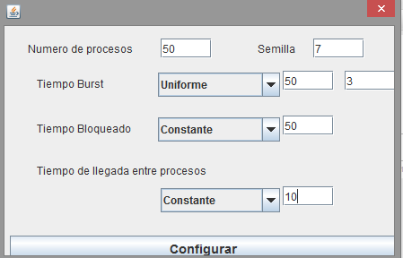

# EJERCICIO 2

Planteado el siguiente escenario.

Simular paso a paso con cada una de las políticas de planificación intentando determinar con una unidad de tiempo de antelación cual será la siguiente tarea que se ejecute.

Entre los Algoritmos de FIFO y Menos tiempo restante primero, ¿quién funciona mejor para las siguientes situaciones?

a. Tiene inconvenientes, porque puede causar riesgo de inanición de los procesos de larga duración.

b. Tiende a favorecer aquellos procesos que requieren más tiempo de CPU.

c. Tiende a tener ventajas cuando minimiza el tiempo de espera medio.

Entre Los Algoritmos Expropiable y No Expropiable, defina cuál de las siguientes afirmaciones son correctas:

a. Permite cambiar de proceso en plena ejecución.

b. Los procesos de larga duración sufren riesgo de inanición.

c. Adecuado para implementar tiempo compartido.

d. Si el quantum es muy pequeño se provocarían constantemente cambios de contexto, disminuyendo el rendimiento.

e. Tiene tiempos de espera bastantes largos.
