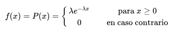

# Trabajo Practico

## Planificación de procesos

El Sistema Operativo permite simplificar la gestión de recursos. La administración eficiente de los recursos implica una cuidadosa planificación del uso de cada uno. El procesador o CPU es un recurso clave, su correcta planificación constituye uno de los puntos centrales en el diseño de un buen Sistema Operativo. Comprender cada uno de los conceptos relacionados a los Sistemas Operativos y la interrelación de todas sus componentes, no es simple.

El objetivo de la práctica es comprender el funcionamiento de las distintas políticas de planificación del procesador en sistemas mono-procesador. Al finalizar se tiene que conocer las ventajas e inconvenientes de cada una de las políticas analizadas. Se utilizará una aplicación que permite simular las distintas políticas de planificación.

El programa permite cargar distintos parámetros, en el que se describen las características de las tareas que lo forman y luego, ya desde el entorno gráfico, se puede someter el conjunto de tareas a las distintas políticas de planificación. El programa de simulación funciona sobre Java.

Se puede observar que el Planificador de Procesos tiene una función importante en los SOs, su buen desempeño permitirá entre otras, el máximo aprovechamiento de la CPU, y en consecuencia un rendimiento óptimo. Esta propiedad es la que nos interesa que el alumno comprenda a través de prácticas de laboratorio. Es por ello que proponemos un Simulador del Planificador de Procesos.

## Objetivos

La Planificación de procesos tiene como principales objetivos la equidad, la eficacia, el tiempo de respuesta, el tiempo de regreso y el rendimiento.

Equidad: Todos los procesos deben ser atendidos.

Eficacia: El procesador debe estar ocupado el 100% del tiempo.

Tiempo de respuesta: El tiempo empleado en responder las solicitudes del usuario debe ser el menor posible.

Tiempo de regreso: Reducir al mínimo el tiempo de espera de los resultados esperados por los usuarios.

Rendimiento: Maximizar el número de tareas que se procesan por cada hora.

## Políticas de Planificación

Existen numerosas políticas de asignación de la CPU a los procesos listo para ejecutar, esperando en la cola. Las políticas pueden ser clasificadas según el esquema de asignación de la CPU a los distintos procesos, por ello se pueden tener dos categorías generales de algoritmos:

No expulsivas/No expropiables: el proceso que está en la CPU lo abandona cuando quiere.

Expulsivas / expropiables: el planificador puede desalojar al proceso que está en la CPU.

El Simulador del Planificación de Procesos permitirá seleccionar entre las políticas más conocidas, ellas son:

### 1.- FCFS/ FIFO (First Come, First Served)

El primero que llega es el primero en ser atendido. No es expropiativo y no emplea prioridades. Es un algoritmo muy sencillo de implementar, basta con emplear una cola FIFO, pero corre el peligro de que un proceso muy largo monopolice la CPU durante mucho tiempo generando tiempos de espera mayores de los que serían deseables.

### 2.- Menos Tiempo Restante Primero SJF (Short Job First)

El trabajo más corto primero. Se seleccionará el proceso que requiera menor tiempo de ejecución (si dos tienen el mismo tiempo se decide por FIFO). El problema puede aparecer con procesos muy largos que están siempre bloqueados por procesos más cortos. Este algoritmo puede ser expropiativo o no.

En la variante expropiativa denominada SRTN (Shortest Remaining Time Next) medimos el tiempo restante que le queda a cada proceso. (No se encuentra en el simulador)

### 3.- Round-Robin (RR)

Se reparte el tiempo de CPU en quantums. El funcionamiento es dar un quantum a cada proceso de forma secuencial. La selección de entre los procesos activos se gestiona según una cola FIFO o lo que es lo mismo se elige el que más tiempo lleve esperando. Si llega un proceso nuevo y hay otro en ejecución, los ciclos de CPU se distribuyen entre ambos, pero se ejecuta un ciclo de CPU para el proceso en ejecución e inmediatamente se le asigna un ciclo al recién llegado. Como se puede deducir, este algoritmo es expropiativo y no emplea prioridades.

### 4.- Preemptive Shortest job First PSJF

Es similar al SJF, con la diferencia de que si un nuevo proceso pasa a listo se activa el dispatcher para ver si es más corto que lo que queda por ejecutar del proceso en ejecución. Si es así, el proceso en ejecución pasa a "listo" y su tiempo de estimación se decremento con el tiempo que ha estado ejecutándose.

Los procesos llegan a la cola y solicitan un intervalo de CPU, si dicho intervalo es inferior al que le falta al proceso en ejecución para abandonar la CPU, el nuevo proceso pasa a la CPU y el que se ejecutaba a la cola de preparados.

---

## Descripción Del Programa

### Lectura de los Resultados

***CPU:*** Tiempo "Real" en el reloj del CPU.

***Tiempo de Respuesta:*** es el intervalo de tiempo desde que el proceso es cargado en "cola listo" hasta que brinda la primera respuesta.

***Tiempo Turnaround:*** es el tiempo transcurrido entre que se lanza el proceso y termina.

## Configuración de entrada de los procesos

***Número de Procesos:*** En este caso se define la cantidad de procesos que se cargaran en la simulación.

***Semilla:*** Hace referencia del valor que se toma para la generación de los números aleatorios.

***Tiempo Burst:*** Es el tiempo de consume cada proceso en general.

***Tiempo de Bloqueado:*** Es cuando un proceso espera un evento que solo puede ser provocado por otro proceso del mismo conjunto.

***Tiempo de llegada entre Procesos:*** Es el Tiempo de llegada de cada proceso para ser atendido por el procesador.

Se puede configurar el Tiempo Burst, Tiempo de Bloqueado y Tiempo de llegada entre Procesos con distintas distribuciones de probabilidad:

***Constante:*** Corresponde al caso de una variable aleatoria que sólo puede tomar un valor.

***Distribución Normal:*** La distribución normal es una distribución con forma de campana donde las desviaciones estándar sucesivas con respecto a la media establecen valores de referencia para estimar el porcentaje de observaciones de los datos.

***Distribución exponencial:*** En estadística la distribución exponencial es una distribución de probabilidad continua con un parámetro lambda > 0 cuya función de densidad es:

